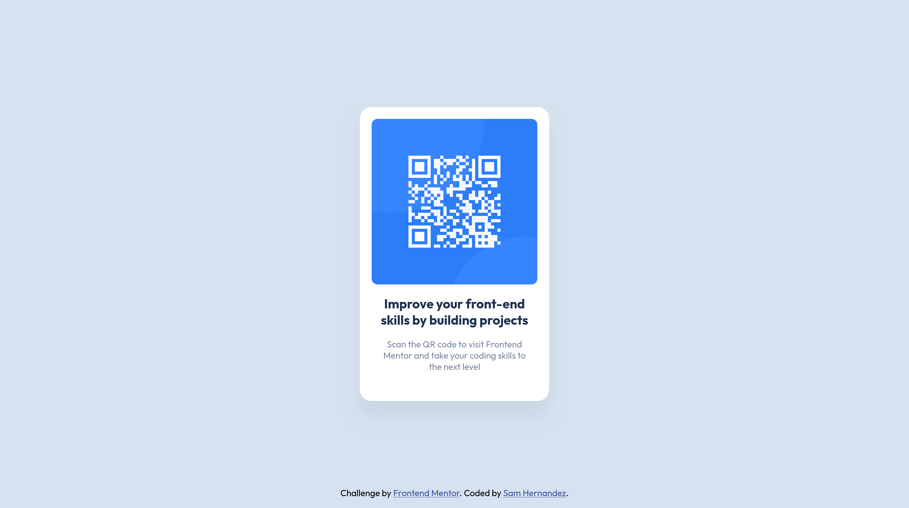

# Frontend Mentor - QR code component solution

This is a solution to the [QR code component challenge on Frontend Mentor](https://www.frontendmentor.io/challenges/qr-code-component-iux_sIO_H). Frontend Mentor challenges help you improve your coding skills by building realistic projects. 

## Table of contents

- [Overview](#overview)
  - [Screenshot](#screenshot)
  - [Links](#links)
- [My process](#my-process)
  - [Built with](#built-with)
  - [What I learned](#what-i-learned)
  - [Continued development](#continued-development)
  - [Useful resources](#useful-resources)
- [Author](#author)

## Overview

### Screenshot

### Links

- Solution URL: [Add solution URL here](https://your-solution-url.com)
- Live Site URL: [Add live site URL here](https://your-live-site-url.com)

## My process

### Built with

- Semantic HTML5 markup
- CSS custom properties
- Flexbox

### What I learned

As this is my first Frontend Mentor challenge project, this was my first ever exposure to Figma! It was really interesting to get hands on with the Figma design files provided in with the project and have more accurate ways of viewing things like spacing, font sizes, and width/height for all elements. This made CSS styling a breeze and I'm looking forward to utilizing Figma in the future.

I also got hands on with my first variable font [Outfit](https://fonts.google.com/specimen/Outfit) in this project. This has driven me to explore more variable style fonts in my own personal projects and any project going forward.

For the first time I also used the [Sass](https://sass-lang.com) pre-processor. It was a recommendation for this project to utilize a pre-processor of choice, and Sass is the one I settled with and had a great time exploring it!

### Continued development

One thing I want to focus on is using flexbox more effectively. Throughout this project, I feel that I have used flex extensively. Almost to the point where I'm concerned of over using flexbox and perhaps find simpler or more efficient method of handling tasks such as centering elements both horizontally. 

### Useful resources

- [Aligning items in a flex container](https://developer.mozilla.org/en-US/docs/Web/CSS/CSS_flexible_box_layout/Aligning_items_in_a_flex_container) - This helped me because for some reason I get mixed up between align-items and align-content, so this definitely saves me when it comes to centering elements in flex containers.
- [Sass Basics](https://sass-lang.com/guide/) - This guide to using Sass helped me understand more about how to set up the pre-processor and get a feel for how it works. I definitely plan on using Sass in the future to compile my CSS files.

## Author

- Frontend Mentor - [@S067130H](https://www.frontendmentor.io/profile/S067130H)
